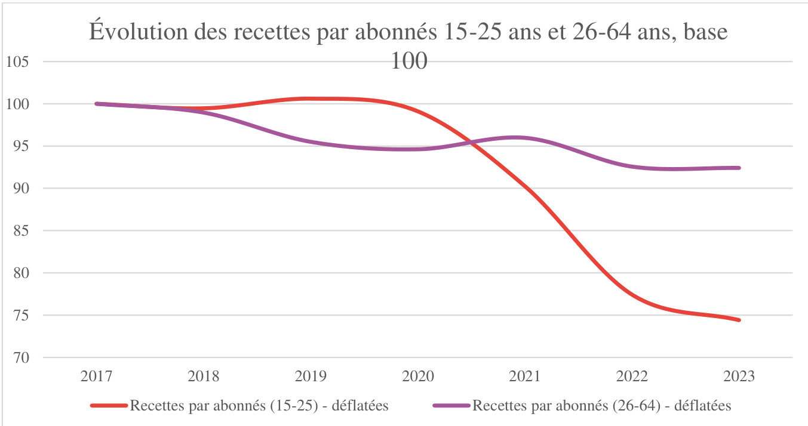

# RAPPORT D’OBSERVATIONS DÉFINITIVES  

# SYTRAL MOBILITÉS  

LES SOUTIENS PUBLICS EN FAVEUR DE LA MOBILITÉ DES JEUNES  

(Métropole de Lyon) Exercices 2015 et suivants  

Synthèse Novembre 2024  

# AVERTISSEMENT  

Cette synthèse est destinée à faciliter la lecture et l’utilisation du rapport d’observations définitives de la chambre régionale des comptes, délibérées le 30 juillet 2024.  

Seul le rapport engage la chambre.  

# SYNTHÈSE  

Sytral Mobilités est l’autorité organisatrice des mobilités (AOM) qui organise les transports sur l’ensemble de son ressort territorial qui compte 263 communes de la région lyonnaise. Second AOM français, l’établissement public a transporté plus de 494 millions de voyageurs en 2023, retrouvant un dynamisme proche de l’avant crise sanitaire. Son taux de couverture des dépenses par les recettes billettiques, de l’ordre de $50\;\%$ en 2022, est particulièrement élevé comparativement à d’autres réseaux français.  

Dans le cadre d’une enquête thématique nationale pilotée par la Cour des comptes s’intéressant aux soutiens publics en faveur de la mobilité des jeunes, la chambre a examiné la politique de Sytral Mobilités à destination des 15-25 ans. Des retraitements ont été effectués par la chambre compte tenu d’un suivi par l’opérateur qui ne permet d’identifier l’âge des usagers et du fait que les abonnements privilégiés concernent les tranches d’âge 11-17 ans et 18-25 ans. Dans ces conditions, les estimations chiffrées de la chambre présentent un caractère évaluatif.  

Le champ de l’enquête a été circonscrit à la métropole de Lyon. Il en ressort que Sytral Mobilités, sans conduire une politique qui aurait été spécifiquement tournée vers le public jeune en tant que tel, a été à l’origine d’évolutions tarifaires qui lui sont favorables dans le cadre d’une politique présentant une dimension sociale.  

# Une évolution tarifaire globalement très favorable aux jeunes, marquée par des évolutions notables de la grille tarifaire en 2019 et 2021  

D’une manière générale, le moindre niveau de revenu des jeunes par rapport au reste de la population et leur plus forte dépendance au réseau des transports en commun ont motivé l’évolution des grilles tarifaires.  

La refonte de la grille tarifaire opérée en 2019, passe d’une tarification au statut (lycéen, étudiant) à une tarification à l’âge. Celle-ci a été plus particulièrement justifiée par le constat qu’une partie des jeunes (jeunes actifs, jeunes sorties des études) « échappait $\gg$ alors au tarif réduit attribué aux étudiants et que les jeunes actifs de la tranche d’âge 18-25 ans bénéficiaient moins que ceux de la tranche des 26-34 ans de la prime transport versée par les employeurs. Sytral mobilités avait aussi estimé que la sollicitation de pièces justificatives liées au statut (collégiens, lycéens, étudiants…) pouvait être à l’origine de ruptures d’abonnement.  

De nouvelles mesures très favorables aux jeunes dans le cadre d’une politique sociale plus classique ont été mises en œuvre en 2021 par la nouvelle majorité au conseil d’administration.  

Ces choix politiques ont au final visé le public jeune dans son ensemble et plus particulièrement les moins favorisés d’entre eux (boursiers, bénéficiaires du revenu de solidarité de la métropole, …). Ils ont permis de fidéliser davantage de jeunes sur la base d’abonnements à tarifs réduits, ce qui constituait un objectif de Sytral Mobilités. Le passage de jeunes du plein tarif au tarif réduit, l’effet de la baisse des tarifs et une politique visant à privilégier les abonnements au détriment des ventes à l’unité, ainsi que le développement de l’offre de transport, tendent à expliquer cette tendance.  

  
Graphique ${\bf\pi}^{\circ}\,{\bf1}$ :  Évolution des validations par catégorie d'usagers, base 100 en 2015   
Source : Sytral Mobilités, retraité CRC. Les étudiants/jeunes englobent les abonnements et tickets étudiants (avant la refonte de 2019) et les actuels 18-25 ans. Les scolaires regroupent les abonnements, les tickets scolaires et l’actuel abonnement 11-17 ans.  

# D’autres actions intéressent plus ou moins directement les jeunes  

En termes d’adaptation des dessertes, les lignes « juniors directs $\gg$ ont pour but de faciliter la desserte scolaire des collégiens et lycéens, venant en appoint du réseau de transport en commun tout public de la métropole de Lyon.  

Les communes de Vénissieux et de Vaulx-en-Velin, dont les jeunes font l’objet d’une attention particulière dans le cadre de la politique de la ville, seront prochainement desservies par de nouvelles lignes de tramway.  

Plus marginalement, les jeunes sont susceptibles comme les autres, de bénéficier de dessertes adaptées liées à des événements ou d’une offre pour trois lignes de bus en dehors des heures de passage habituelles la nuit du jeudi au dimanche.  

Alors que le sentiment d’insécurité peut constituer un frein à la mobilité, Sytral Mobilités est à l’origine de campagnes de sensibilisation du public jeune dans les établissements scolaires dans le cadre de sa politique de sécurisation du réseau. Plus de 15 000 jeunes ont ainsi été sensibilisés en 2023.  

# Un effort financier non négligeable en faveur des jeunes  

Le manque à gagner généré pat les baisses tarifaires accordées aux jeunes représente un effort financier significatif qui a pu être financé par le dynamisme du versement mobilités.  

L’évaluation de ce manque à gagner n’est guère aisée car elle dépend de plusieurs hypothèses  de calcul.  

Une première approche sommaire consiste à évaluer le manque à gagner par simple différence entre le plein tarif et les tarifs réduits, hors effet de l’élasticité prix1. Celui-ci peut être estimé dans ces conditions $\hat{\mathbf{a}}\,50\,\mathrm{M}\boldsymbol{\epsilon}$ par an depuis les refontes tarifaires introduites en 2019 (plus si on intègre les décisions précédentes). Ce  montant  s’entend  comme un plafond .  

En intégrant le paramètre de l’élasticité prix2, Sytral Mobilités évalue ce manque à gagner à $10{,}5\,\mathrm{M}\epsilon$ par an. Ce montant doit être appréhendé comme un minimum car Sytral Mobilités a fait le choix de ne pas prendre en compte les baisses tarifaires imposées par la loi et certaines hypothèses de calcul peuvent être discutées.  

Quoi qu’il en soit, l’effort tarifaire demandé aux jeunes a fortement diminué depuis 2017, ce d’autant plus si l’on intègre l’effet de l’inflation. Bien que comparativement bien plus important, l’évolution de l’effort de la tranche d’âge 26-64 ans est lui aussi restée inférieur à l’inflation.  

  
Graphique $\mathbf{n}^{\circ}\mathbf{\delta}^{2}$ : Recettes déflatées par abonnés 15-25 ans et 26-64 ans, base 100 en 2017   
Source : à partir des données Sytral Mobilités – retraitement CRC. Indice des prix à la consommation INSEE hors tabac– France métropolitaine.  

  

Chambre régionale des comptes Auvergne-Rhône-Alpes 124-126 boulevard Vivier Merle CS 23624 69503 LYON Cedex 03  

auvergnerhonealpes@crtc.ccomptes.fr  